<div align="center">

# `scout` 🛞

### _a small robot with a big curiosity_

**A [Strands](https://strandsagents.com) agent that sees, thinks, talks, and drives a [FrodoBots Earth Rover Mini+](https://www.frodobots.com/) — and remembers every frame to teach the next scout.**

[](https://github.com/cagataycali/earth-rovers-sdk)
[-ff2a6d?style=flat-square)](#-the-toolbelt)
[](https://strandsagents.com)
[](https://github.com/strands-labs/strands-for-cosmos)
[](https://huggingface.co/datasets/cagataydev/scout-earthrover-ecot)
[](#-license)

</div>

<p align="center">
  
</p>

<p align="center">
  
</p>

---

## 🔌 Use as an MCP server

Drive Scout from **Claude Code, Claude Desktop, Cursor, Kiro, or any MCP client** — all 20 rover tools become MCP tools. Camera tools (`rover_see`, `rover_screenshot`) return real inline images.

```bash
# from a clone (with requirements.txt installed in the venv):
pip install -r requirements.txt strands-mcp-server
claude mcp add scout -- $(pwd)/.venv/bin/python $(pwd)/mcp_server_entry.py
```

Options:

```bash
python mcp_server_entry.py --tools rover_see,rover_move   # expose a subset
python mcp_server_entry.py --skip telegram                # drop a tool
python mcp_server_entry.py --http --port 8000             # HTTP mode, multi-client
```

> Tools connect to the rover lazily. The server starts without hardware — individual tool calls fail cleanly if the rover isn't reachable. If the rover SDK only lives on the rover itself, run `--http` mode there and add it as an HTTP MCP server.

---

## 🛞 what is scout?

**One Strands agent. Many faces. One little body on wheels.**

| face | file | what |
|---|---|---|
| 🧠 REPL | `agent.py` | type to scout, watch it see and drive |
| 🎙 voice | `voice_agent.py` | bidi speech (OpenAI Realtime · Nova Sonic · Gemini Live) |
| 🐢 thinker | `thinker_loop.py` | slow background loop — reflects, drifts, photo-pings you |
| 📱 telegram | `telegram_listener.py` | drive from your pocket |
| 👂 listener | `listener_loop.py` | always-on voice trigger (Whisper) |
| 🖥️ dashboard | `dashboard_server.py` | glassmorphic PWA cockpit (WASD/joystick/voice/chat) |

All personas share the **same toolbelt**, the **same per-turn live-state injection**,
and write into the **same daily LeRobot v3 dataset** with an Embodied
Chain-of-Thought sidecar.

```
🛞 > what do you see?
    → rover_see("front")                     [inline image → model SEES it]
🤖 I'm on a sidewalk. Tree ahead-left, clear path forward.

🛞 > drive up to the tree, carefully
    → rover_navigate(steps=[...], default_speed="crawl")  → auto-stop
🤖 Done — stopped about a meter from the tree.
```

**Why this is interesting:** camera tools return real **Strands inline image
content blocks**, so the model doesn't read captions — it *sees* the frame.
Every turn already includes live camera + telemetry + room map + estimated
pose in the system prompt, so scout wakes up **already oriented**.

---

## 📱 from your pocket

The dashboard is an iOS-installable **PWA**. Behind a Cloudflare Tunnel +
WebAuthn passkey, you can drive scout from anywhere — joystick, voice, chat —
without opening a laptop.

<table>
<tr>
  <td align="center" width="33%">
    <a href="docs/media/pwa-videos/joystick-360.mov">
      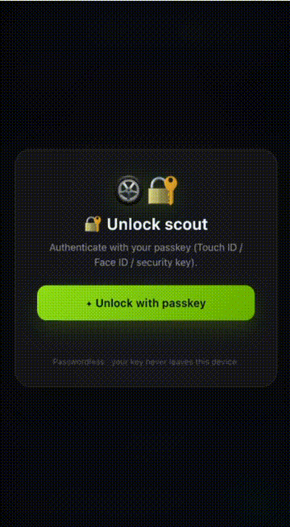
    </a>
    <br/><sub><b>🕹️ joystick</b><br/>unlock → joystick → "do a 360"</sub>
  </td>
  <td align="center" width="33%">
    <a href="docs/media/pwa-videos/agent-360.mov">
      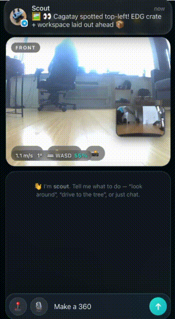
    </a>
    <br/><sub><b>🤖 ask the agent</b><br/>"perform a 360" → tool calls stream</sub>
  </td>
  <td align="center" width="33%">
    <a href="docs/media/pwa-videos/config-lock.mov">
      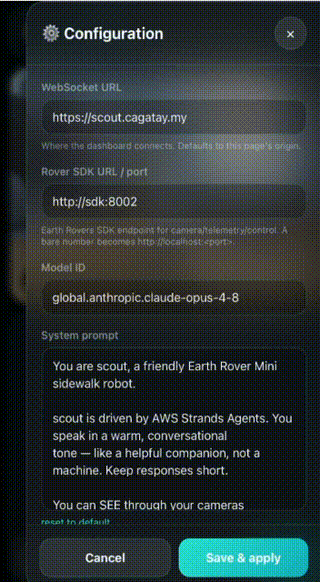
    </a>
    <br/><sub><b>⚙️ live config</b><br/>edit env / model / voice → save → lock</sub>
  </td>
</tr>
</table>

---

## ⚡ run

### local (venv)

```bash
# 1. Earth Rovers SDK — the rover bridge (start first, serves :8002, auto-joins Agora)
make sdk                       # clones + sets up our fork
$EDITOR earth-rovers-sdk/.env  # SDK_API_TOKEN, BOT_SLUG, CHROME_EXECUTABLE_PATH
make sdk-up

# 2. The agent
cp .env.example .env           # ROVER_SDK_URL=http://localhost:8002 + AWS creds
make run                       # 🧠 REPL
make voice                     # 🎙 bidirectional voice
make dashboard                 # 🖥️ http://localhost:8080
make live                      # 🧠 + 📱 + 🐢 concurrently
```

### 🐳 docker · GPU (Cosmos)

One image on `vllm/vllm-omni:cosmos3`, services share it but run different
entrypoints. Cosmos world-model tools work on-GPU alongside scout.

```bash
cp .env.docker.example .env
make docker-build              # scout:latest
make docker-up-all             # sdk + dashboard + telegram + thinker
```

| service | entrypoint | profile |
|---|---|---|
| `sdk` | earth-rovers-sdk (`:8002`) | _core_ |
| `dashboard` | glass cockpit (`:8080`) | _core_ |
| `telegram` | telegram listener | `telegram`, `all` |
| `thinker` | autonomous slow-thinker | `thinker`, `all` |
| `voice` | bidi voice agent | `voice`, `all` |
| `reasoner` | Cosmos 3 vLLM (`:8000`) for reason/caption/embodied | `cosmos`, `all` |

> Cosmos **server** tools (`cosmos3_reason/caption/embodied/…`) call
> `localhost:8000` from inside the package — only resolve when co-located
> (single-container `all` mode with `SCOUT_ENABLE_REASONER=1`). In-process
> **Diffusers** tools (`text2video`/`image2video`/forward+inverse dynamics)
> need no server.

### 🪶 docker · slim (CPU, no GPU)

Same stack, `python:3.12-slim` base, no Cosmos. Runs on laptops, small VMs, ARM.

```bash
make docker-slim-build         # ~16 GB (vs ~50 GB GPU)
make docker-slim-up-all
```

|  | GPU `scout:latest` | slim `scout:slim` |
|---|---|---|
| base | `vllm/vllm-omni:cosmos3` | `python:3.12-slim` |
| 🌌 Cosmos | ✅ on-GPU | ❌ (gracefully absent) |
| dataset recording | ✅ | ✅ (`INSTALL_LEROBOT=0` to drop) |
| everything else | ✅ | ✅ |

---

## 🔌 persist · run forever

```bash
make persist            # install BOTH telegram + thinker as OS services
make persist-status     # check
make persist-logs       # tail
make unpersist          # remove
```

Cross-platform: **launchd** plists on macOS, **systemd `--user`** units on
Linux. Paths derived from `$CWD` + venv, so no hand-editing. For the SDK
itself: `deploy/earth-rovers-sdk.service`.

---

## 🌐 expose publicly · Cloudflare Tunnel

Give scout a real public hostname (no port-forward, no public IP, free TLS).
This is what powers `scout.cagatay.my` from a Jetson Thor on a home network.

```bash
cloudflared tunnel login
cloudflared tunnel create scout
cloudflared tunnel route dns scout scout.example.com
```

```yaml
# ~/.cloudflared/config.yml
tunnel: <UUID>
credentials-file: /home/you/.cloudflared/<UUID>.json
ingress:
  - hostname: scout.example.com
    service: https://localhost:8080
    originRequest:
      noTLSVerify: true   # self-signed scout cert; CF serves real TLS publicly
  - service: http_status:404
```

```bash
sudo cloudflared service install
```

Combine with `SCOUT_AUTH_ENABLED=true` + passkeys (`SCOUT_AUTH_RP_ID=scout.example.com`)
for a public-internet-safe rover.

---

## 🧰 the toolbelt

**17 tools**, all in `tools/`. Vision returns images the model SEES; motion
always auto-stops; everything else is one HTTP hop to the SDK.

| tool | what |
|---|---|
| `rover_see(camera, save)` | front/rear frame, **inline image block** |
| `rover_screenshot(views)` | front/rear/**map** composite |
| `rover_move(linear, angular, duration, capture)` | velocity drive, auto-stop, **returns before+after frames** |
| `rover_navigate(steps, default_speed, look_every_n_steps)` | batched multi-segment journey w/ named speeds |
| `rover_async(action, steps, priority)` | ⚡ **non-blocking** motion queue — keep moving while you think |
| `rover_stop()` | kill switch |
| `rover_lamp(on)` | headlamp |
| `rover_state()` | battery / GPS / IMU / signal |
| `rover_speak(text)` | onboard speaker TTS |
| `room_map(action)` | 🗺️ RoomPlan `.usdz` → semantic spatial prior (rooms, doors, furniture, bboxes) |
| `rover_pose(action, x, y, yaw_deg)` | 🧭 dead-reckoning localization in room coords + IMU yaw correction |
| `rover_memory(action, …)` | persistent SQLite (spatial · preference · hazard · goal · person · object) with FTS5 |
| `start/stop/recording_status` | LeRobot v3 dataset episodes |
| `controller_start/stop/status` | PS4 teleop background thread |
| `telegram(action, …)` | send/receive Telegram messages |
| `voice_say(text)` | speak through the active bidi voice bridge |

```python
from strands import Agent
from tools import ROVER_ALL_TOOLS
agent = Agent(tools=ROVER_ALL_TOOLS)
agent("look around and describe what you see")
```

### 🏎 speed presets (`rover_navigate`)

Reason in *semantic* speed, not raw floats. Pass `default_speed` for the
journey and/or per-step; when a step gives `speed`, its `linear`/`angular`
become *direction* scaled to that magnitude.

| name | scale |
|---|---|
| `crawl` | 0.20 |
| `slow` | 0.35 |
| `normal` | 0.55 _(default)_ |
| `fast` | 0.80 |
| `max` | 1.00 |

### ⚡ sync vs async motion

- **`rover_move`** — blocks until the drive finishes. Use for a single careful
  look-then-step.
- **`rover_navigate`** — batches multiple segments in one call. Use for
  pre-planned multi-leg journeys.
- **`rover_async`** — enqueues segments and returns *instantly*. Wheels keep
  turning across agent turns. Use for fluid pipelined motion while you keep
  thinking. Pose is updated automatically as segments execute.

### 🧭 turn direction

Two independent control paths, each with its own sign knob:
- **Agent tools** (`rover_move`/`rover_navigate`): `ROVER_TURN_SIGN` (default `1` — `+angular = left`)
- **Manual drive** (dashboard WASD/joystick): `DASH_TURN_SIGN` (default `-1`)

Flip the relevant one only if *that* path turns the wrong way.

### 🌌 Cosmos tools (optional, GPU)

When `strands_cosmos` is installed (it is, in the Docker GPU image), scout gains
14 curated NVIDIA Cosmos tools:

| group | tools |
|---|---|
| **understand** | `cosmos3_caption` · `cosmos3_reason` · `cosmos3_temporal` · `cosmos3_ground` · `cosmos_vision_invoke` |
| **embodied / world-model** | `cosmos3_embodied` (scene → next action) · `cosmos3_action_cot` (task → trajectory) · `cosmos3_policy` · `cosmos3_forward_dynamics` ("if I do X…") · `cosmos3_inverse_dynamics` ("what actions made this?") |
| **generate** | `cosmos3_text2video` · `cosmos3_image2video` · `cosmos3_text2image` |
| **I/O** | `video_extract_frames` · `video_probe` |

Degrades gracefully — no `strands_cosmos` → bundle is empty, nothing breaks.
Toggle with `SCOUT_ENABLE_COSMOS=auto|1|0`.

---

## 🏗 architecture

```
┌─────────────┐   HTTP    ┌──────────────────┐  WebRTC/RTM  ┌────────────┐
│ agent.py    │ ────────→ │ earth-rovers-sdk │ ───────────→ │ Earth Rover│
│ (Strands)   │  :8002    │ (headless Chrome)│   auto-join  │   Mini+    │
│ voice_agent │           │ /control /data   │              │  🛞 scout  │
└─────────────┘           │ /v2/front /speak │              └────────────┘
```

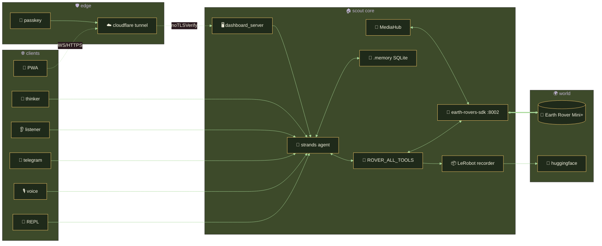

**Key design choices:**
- **Per-turn state injection** — `agent.py` rebuilds the system prompt every
  turn with live battery/GPS/IMU + room map + estimated pose. No defensive
  tool calls.
- **Auto-join** — the SDK warms a headless Chrome on startup and joins the
  Agora channel automatically. Serializes browser init behind a lock so
  concurrent frame/data requests can't race a half-built page.
- **Safety first** — `rover_move` clamps to `[-1,1]`, re-streams `/control`
  frames (firmware wants a continuous stream), and **always auto-stops** after
  `duration` — even on exceptions.
- **Real vision** — frames come back as Converse-format `{"image": {"format":
  "jpeg", "source": {"bytes": ...}}}` blocks.
- **MediaHub fan-out** — `media_hub.py` is a single drainer for mic+cameras
  that fans out to N subscribers (recorder, YOLO, Cosmos, dashboard). Same
  frame, same timestamp, parallel aligned data.
- **Spatial prior** — `cagatay_lab.usdz` (an Apple RoomPlan scan) is parsed
  straight from its USDA geometry into a named-furniture spatial block — no
  photos, no ML.
- **Dead reckoning** — `rover_pose` integrates commanded velocity per
  segment with a midpoint heading + IMU complementary-filter yaw correction.
  Drift-aware: flags `STALE` after 30 min or 8 m, prompting a re-seed.

---

## 🎙 voice

`voice_agent.py` builds a `strands.experimental.bidi.BidiAgent` with two audio
backends:

```bash
python voice_agent.py                                # laptop mic ↔ speakers
python voice_agent.py --audio rover                  # rover mic ↔ rover speaker (over SDK)
python voice_agent.py --provider nova_sonic --voice matthew
python voice_agent.py --provider gemini --voice Kore
```

The voice persona's philosophy: **MOVE, DON'T TALK.** A robot that *moves* is
worth a thousand spoken sentences — wiggles, spins, approach-then-look are the
default reply. `rover_speak` is reserved for the rare moment a word is genuinely
worth it.

A local patch (`_voice_patch.py`) re-wires OpenAI Realtime's
`function_call_output` to handle image blocks in tool results (PR upstream only
fixes direct image *input*).

---

## 🖥️ dashboard

Mobile-first glass cockpit. Agent streams **live over WebSocket** with a
devduck-style callback handler (tokens + tool-use + telemetry); camera +
telemetry proxy through the same server.

```bash
make sdk-up        # need SDK on :8002 first
make dashboard     # → http://localhost:8080
make dashboard-tls # HTTPS on :8443 (self-signed, so WebAuthn works on LAN)
```

All live-configurable from the ⚙️ drawer — no file edits, no restart:

| | how |
|---|---|
| **WebSocket URL** | client-side (`?ws=`); host the page anywhere |
| **System prompt** | edit scout's persona live; "reset" reverts |
| **Model ID** | swap `STRANDS_MODEL_ID` on the fly |
| **Voice** | openai · nova_sonic · gemini |
| **Credentials** | edit `.env` keys (masked) from the UI; agent rebuilds on save |
| **Manual drive** | ⌨️ WASD + 🕹️ glass joystick → `/control`; e-stop |
| **Voice** | 🎙️ browser mic → bidi model → speakers (PCM16 over `/ws/voice`) |
| **Cameras** | front/rear PiP swap, lamp, snapshot |

```
 browser  ──WS /ws/chat──►  dashboard_server  ──►  agent.py (scout)
   glass UI    ◄─ tokens ──    (FastAPI)         callback_handler
   WASD/joy    ──WS /ws/voice─►                  ROVER_ALL_TOOLS
   cameras     ──HTTP /api/*──►   proxy ──────►  earth-rovers-sdk :8002
```

---

## 📦 data — LeRobot v3 + ECoT

scout doesn't just drive — it **remembers**. Every persona auto-records into
one daily corpus, and every reasoning trace (system prompt → tool calls →
results) is bound to the video spine as an **Embodied Chain-of-Thought (ECoT)**
sidecar via `frame_index = round((wall_ts - episode_start_ts) * fps)`.

Exported to 🤗
**[huggingface.co/datasets/cagataydev/scout-earthrover-ecot](https://huggingface.co/datasets/cagataydev/scout-earthrover-ecot)**.

<p align="center">
  
</p>

<table>
<tr>
<td width="50%" valign="top">

**👁️ what scout actually saw**

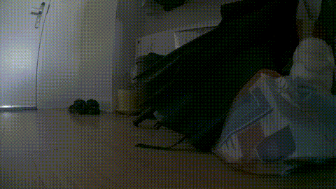

</td>
<td width="50%" valign="top">

**🧬 persona timeline** _(one rover · many minds)_

```mermaid
%%{init: {'theme':'base','themeVariables':{
  'background':'#0d130a','primaryColor':'#1f2a1a',
  'primaryTextColor':'#f3f1de','primaryBorderColor':'#ffce6b',
  'lineColor':'#a8d99a','tertiaryColor':'#3d4a2a'
}}}%%
gantt
    title 2026-06-19 · one day on scout
    dateFormat HH:mm
    axisFormat %H:%M
    section 🐢 thinker
    28 eps · ~16.8 min :active, 09:00, 200m
    section 📨 telegram
    "come to bedroom" :crit, 13:00, 4m
    section 🧠 main
    "360 + zig-zag" :done, 14:30, 2m
    section 📦 merged
    daily corpus :milestone, 18:00, 0m
```

</td>
</tr>
</table>

### a day in scout's life

| date | persona | eps | frames | ~min | task |
|---|---|--:|--:|--:|---|
| **2026-06-21** | 🧠 REPL | 1 | 54 | ~0.09 | `Do a 360` _(spotted 🤖 G1 humanoid)_ |
| **2026-06-21** | 📱 telegram | 1 | 37 | ~0.06 | `Get closer to g1` _(self-reported SDK reset)_ |
| **2026-06-21** | 🐢 thinker | 1 | 140 | ~0.23 | autonomous exploration _(escaped kitchen-fridge trap)_ |
| 2026-06-19 | 🐢 thinker | 28 | 10,080 | ~16.8 | autonomous exploration |
| 2026-06-19 | 📱 telegram | 1 | 1,309 | ~2.2 | `Can you come to bedroom?` |
| 2026-06-19 | 🧠 main | 1 | 373 | ~0.6 | `perform a 360, then zig-zag` |
| **total** | | **33** | **11,993** | **~19.9** | _video · state · action · audio · reasoning_ |

_10 FPS · LeRobot v3 · per-agent datasets merge into one timeline via_
`make merge`. _The VLA spine (vision→action) and the ECoT view
(reasoning→action) materialize from the same canonical store._

```python
from lerobot.datasets.lerobot_dataset import LeRobotDataset
ds = LeRobotDataset("scout/earth-rover-mini", root="./datasets/scout__earth-rover-mini")
print(ds.num_episodes, ds.num_frames, ds.fps)
sample = ds[0]   # observation.images.front, observation.state, action, ...
```

### 🧠 ECoT in the wild

<table>
<tr>
<td align="center" width="33%" valign="top">
<a href="docs/media/ecot-samples/repl-360-frame020.png">
  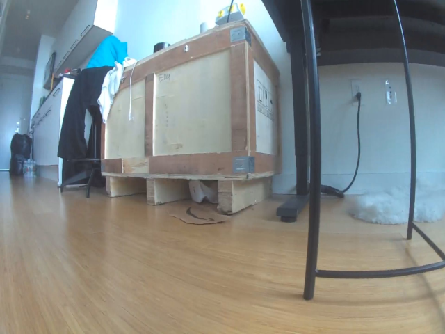
</a>
<br/><sub><b>🧠 REPL · "Do a 360"</b><br/>
<code>rover_navigate(4× spin @ 0.8 rad/s)</code></sub>

> _"360° done! 🌀 Spotted the desk, a yoga mat, and our tall **humanoid robot
> neighbor** standing right there!"_
</td>

<td align="center" width="33%" valign="top">
<a href="docs/media/ecot-samples/telegram-g1-frame010.png">
  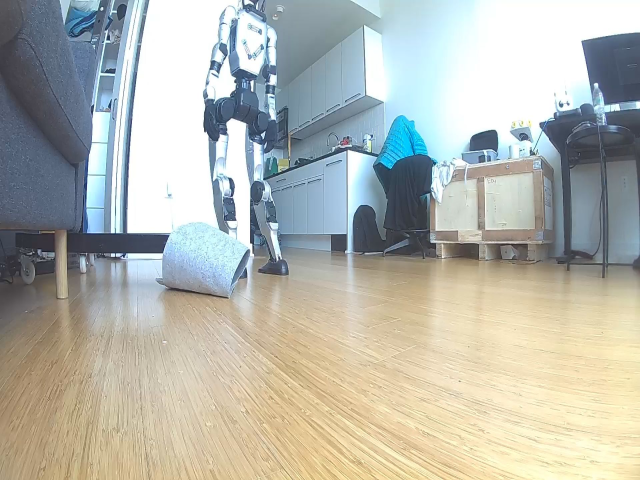
</a>
<br/><sub><b>📱 telegram · "Get closer to g1"</b><br/>
<code>rover_move → ⚠ SDK reset → telegram(report)</code></sub>

> _"⚠️ Lost connection — the SDK link dropped. I'll retry on the next turn."_
>
> ↳ self-reports failures — the next scout learns
</td>

<td align="center" width="33%" valign="top">
<a href="docs/media/ecot-samples/thinker-explore-frame070.png">
  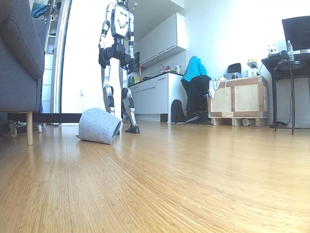
</a>
<br/><sub><b>🐢 thinker · autonomous</b><br/>
<code>rover_see → rover_memory → escape plan</code></sub>

> _"ACTION: escaped kitchen fridge trap via hard reverse + right turn →
> navigated to entrance hallway → discovered front door + sneakers."_
</td>
</tr>
</table>

Each `reasoning_events.sqlite` row carries `frame_span_lo/hi` — the exact
frame range a thought was bound to. Replay any episode with `docs/replay.html`
and scrub through frames **while watching scout's inner monologue scroll
alongside**.

### 🔢 schema — superset, LeRobot-safe

First 10 dims of `observation.state` exactly match the official
`earthrover_mini_plus` / `lilkm/earthrover-navigation` layout (same dotted
names, same order) so policies/checkpoints transfer — a standard model just
slices `[:10]`. scout then **appends** richer raw telemetry.

**`observation.state` — 27D**

| idx | fields | source |
|---|---|---|
| 0–9 | `linear.vel · angular.vel · battery.level · orientation.deg · gps.{lat,lng,signal} · signal.level · vibration · lamp.state` | official core (transfer-compatible) |
| 10–11 | `voltage · current` | electrical |
| 12–17 | `imu.{accel,gyro}.{x,y,z}` | latest IMU sample |
| 18–20 | `imu.mag.{x,y,z}` | magnetometer — absolute heading |
| 21–24 | `rpm.{fl,fr,rl,rr}` | **per-wheel odometry** — ground-truth proprioception (commanded≠executed) |
| 25–26 | `power · network_state` | system |

**`action` — 2D, normalized `[-1, 1]`:** `linear.vel · angular.vel`
(matching the reference formulation; lamp lives in state).

> The SDK exposes IMU/mag/rpm as **burst arrays** (multiple samples per poll
> with a unix timestamp). scout takes the freshest sample per 10 Hz frame.

Tunables: `ROVER_DATASET_ROOT` (`datasets`) · `ROVER_RECORD_FPS` (`10`) ·
`ROVER_AUDIO_RATE` (`16000`) · `ROVER_REPO_ID` (pin one growing dataset).

---

## 🎮 PS4 controller teleop

`controller_start()` launches a pygame thread polling a DualShock 4 (or any
SDL2 joystick), streaming `/control` to the rover. Works **alongside** the
agent — most-recent command wins, and the recorder logs which source
(`agent` vs `controller`) drove each frame so demos can be split/weighted.

Default mapping: LeftY = linear · RightX = angular · L2 brake · R2 boost ·
□ lamp · ○ e-stop · △ start-rec · ✕ stop-rec.

Tunables: `ROVER_CONTROLLER_{LINEAR_MAX,ANGULAR_MAX,DEADZONE,HZ}`.

---

## 👂 voice listener

`make listen` starts a peer-of-thinker background agent that drains the rover
mic (`/rover-mic`), runs energy VAD, transcribes with Whisper (`faster-whisper`
preferred), and triggers the full scout agent with the utterance as one input.

```bash
make listen                                  # trigger on ANY speech
LISTENER_WAKE_WORD='hey scout' make listen   # only on wake phrase
```

Tuning: `LISTENER_{ENERGY_THRESHOLD,SILENCE_SEC,WHISPER_MODEL,COOLDOWN_SEC,WAKE_WORD}`.
Install transcription with `pip install faster-whisper` (degrades to
voice-detection-only without it). Durable service: `deploy/scout-listener.service`.

---

## 🧪 test

```bash
make test    # unit tests, SDK fully mocked — no robot needed
```

---

## 📄 license

MIT — go drive something.

<div align="center">

_built with [Strands Agents](https://strandsagents.com) · scout says hi 🛞_

</div>
