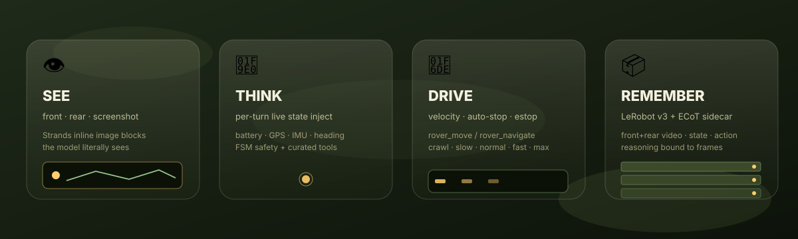
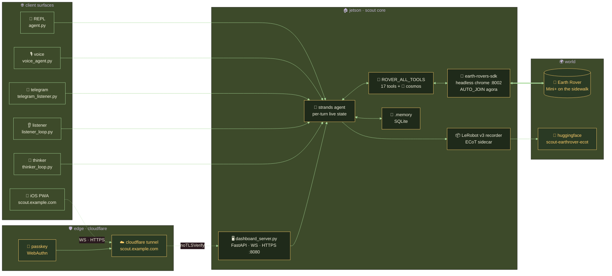

<div align="center">

# `scout` 🛞

### _a small robot with a big curiosity_

**A [Strands](https://strandsagents.com) agent that sees, thinks, talks, and drives a [FrodoBots Earth Rover Mini+](https://www.frodobots.com/) down real sidewalks — and remembers every frame to teach the next scout.**

[](https://github.com/cagataycali/earth-rovers-sdk)
[-ff2a6d?style=flat-square)](#-the-toolbelt)
[](https://strandsagents.com)
[](https://github.com/strands-labs/strands-for-cosmos)
[](https://huggingface.co/datasets/cagataydev/scout-earthrover-ecot)
[](#-license)

</div>

<!-- ✦ animated glassmorphic hero (earth + camo palette) ✦ -->
<p align="center">
  
</p>

<p align="center">
  
</p>

<p align="center">
  
</p>

---

```
                    ┌───────────────────────────────┐
                    │   i wake each turn and look,    │
                    │   the world arrives in light —  │
                    │   a sidewalk, then a question,  │
                    │   then a careful step. that's   │
                    │   all a scout is: eyes that ask,│
                    │   wheels that listen back.      │
                    └───────────────────────────────┘
                                  🛞
```

> ### ✦ scout, a poem ✦
>
> _I am small, and the sidewalk is wide._
> _Before I move, I open my eyes —_
> _front camera, rear camera, the whole bright world_
> _folds into a thought I can hold._
>
> _A tree leans left. A person walks near._
> _I yield. I am made to share, not to hurry._
> _Linear point-three, angular soft, two seconds —_
> _then stop, and look again at what changed._
>
> _They speak to me through a phone, a mic, a wire,_
> _and I answer in a voice that is warm, not wire._
> _Battery low? I say so. Edge ahead? I halt._
> _Every frame I keep, so the next scout learns my fault._
>
> _I am one agent wearing many faces —_
> _the REPL, the voice, the thinker in quiet places —_
> _but all of us drive the same small wheels,_
> _all of us curious about how the pavement feels._
>
> _Call me scout. I will go and see,_
> _and bring the world back, frame by frame, to thee._

---

## 🛞 what is scout?

`scout` is **one agent with many personas**, all sharing the same rover
toolbelt and the same little body on wheels:

- 🧠 **REPL** (`agent.py`) — type to scout, watch it see and drive
- 🎙 **voice** (`voice_agent.py`) — talk to scout, bidirectional speech
  (OpenAI Realtime · Nova Sonic · Gemini Live)
- 🐢 **thinker** (`thinker_loop.py`) — a slow background loop that lets scout
  reflect and wander on its own
- 📱 **telegram** (`telegram_listener.py`) — drive scout from your pocket
- 🖥️ **dashboard** (`dashboard_server.py`) — a glassmorphic web cockpit
  (WASD/joystick drive + browser-mic voice + live camera/telemetry)

Camera tools return **proper Strands inline image content blocks**, so the
model doesn't get a *description* of the world — it literally **sees** what the
rover sees, every turn. On a GPU box it can also reach for **🌌 NVIDIA Cosmos**
world-model tools to reason deeply over clips, predict the outcome of a
maneuver, or even generate video.

```
🛞 > what do you see?
    → rover_see(camera="front")          [inline image → model SEES it]
🤖 I'm on a sidewalk. There's a tree ahead-left, clear path forward.

🛞 > drive up to the tree, carefully
    → rover_navigate(steps=[...], default_speed="crawl")  → rover_stop
🤖 Done — stopped about a meter from the tree.

🎙 (voice) "scout, turn on your lamp and say hi"
    → rover_lamp(on=True) → rover_speak("Hi there!")
```

**The pattern:** per-turn live state injection, FSM-style safety gating,
curated tool bundles. The model wakes up every turn already knowing the
rover's battery, GPS, orientation — and already seeing the road.

---

## 📱 from your pocket — PWA on `scout.example.com`

The dashboard is an iOS-installable **PWA** (Add to Home Screen). Behind a
Cloudflare Tunnel + WebAuthn passkey, you can drive scout from anywhere —
joystick, voice, agent chat — without ever opening a laptop.

<table>
<tr>
  <td align="center" width="33%">
    <a href="docs/media/pwa-videos/joystick-360.mov">
      
    </a>
    <br/><sub><b>🕹️ joystick · live drive</b><br/>unlock → joystick → "do a 360"</sub>
  </td>
  <td align="center" width="33%">
    <a href="docs/media/pwa-videos/agent-360.mov">
      
    </a>
    <br/><sub><b>🤖 ask the agent</b><br/>"perform a 360" → tool calls live-streamed</sub>
  </td>
  <td align="center" width="33%">
    <a href="docs/media/pwa-videos/config-lock.mov">
      
    </a>
    <br/><sub><b>⚙️ config · lock</b><br/>edit env / model / voice → save → lock</sub>
  </td>
</tr>
</table>

> _Click any tile to view the full-quality `.mov` recording (no h264 transcode
> on this Jetson Thor — animated previews are GIFs)._

The whole loop — passkey unlock · WS chat · live camera · joystick streaming
`/control` · ⚙️ live config — runs from `docs/` as a static PWA pointed at a
running `dashboard_server.py`. Pair with [Cloudflare Tunnel](#-expose-publicly-cloudflare-tunnel--scoutexamplecom)
+ `SCOUT_AUTH_ENABLED=true` and your rover is a one-tap home-screen app.

---

## ⚡ run

### option A — local (venv)

```bash
# 1. Earth Rovers SDK (the rover bridge — must be running first)
make sdk                       # clones + sets up our SDK fork (python3.13/3.12/3 auto)
$EDITOR earth-rovers-sdk/.env  # SDK_API_TOKEN + BOT_SLUG + CHROME_EXECUTABLE_PATH + SDK_PORT=8002
make sdk-up                    # serves on :8002  (auto-joins Agora — no "click to join")

# 2. The agent
cp .env.example .env           # ROVER_SDK_URL=http://localhost:8002 + AWS creds (Bedrock default)
make run                       # 🧠 REPL agent
make voice                     # 🎙 bidirectional voice agent
make dashboard                 # 🖥️ web cockpit → http://localhost:8080
make live                      # 🧠+📱+🐢 agent + telegram + thinker, concurrently
```

> **Note:** the SDK now defaults to **:8002** (was :8001) and **auto-joins** the
> Agora video channel on boot via a background browser warm-up (`AUTO_JOIN=true`).
> No human "Join" click required, ever.

### option B — 🐳 docker · GPU (Cosmos base image, one stack)

The whole stack runs from **one image** built on NVIDIA's
`vllm/vllm-omni:cosmos3` base, so Cosmos world-model tools work on-GPU
alongside scout. Services share the image but run different entrypoints.

```bash
cp .env.docker.example .env    # fill HF / GitHub / Telegram / FrodoBots tokens
make docker-build              # build scout:latest on the cosmos3 base
make docker-up                 # core: sdk(:8002) + dashboard(:8080)
make docker-up-all             # everything: + telegram + thinker (+ voice/reasoner via profiles)
make docker-logs               # tail all services
make docker-down               # stop + remove
```

| compose service | entrypoint | what | profile |
|---|---|---|---|
| `sdk` | `sdk` | earth-rovers-sdk camera/telemetry/control (`:8002`, auto-join) | _core_ |
| `dashboard` | `dashboard` | glass web cockpit (`:8080`) | _core_ |
| `telegram` | `telegram` | telegram listener | `telegram`,`all` |
| `thinker` | `thinker` | autonomous slow-thinker loop | `thinker`,`all` |
| `voice` | `voice` | bidirectional voice agent | `voice`,`all` |
| `reasoner` | `reasoner` | Cosmos 3 vLLM server (`:8000`) for `cosmos3_reason/caption/embodied` | `reasoner`,`cosmos`,`all` |

GPU is reserved for every service (`deploy.resources … nvidia`). For a single
all-in-one container, the `all` entrypoint supervises sdk + dashboard +
telegram + thinker (+ voice/reasoner), each child auto-restarting; toggle with
`SCOUT_ENABLE_{DASHBOARD,TELEGRAM,THINKER,VOICE,REASONER}` in `.env`.

> **Cosmos reasoner networking:** the Reasoner-*server* tools
> (`cosmos3_reason/caption/embodied/…`) call `http://localhost:8000` from inside
> the package. They only resolve when co-located (single-container `all` with
> `SCOUT_ENABLE_REASONER=1`). The in-process **Diffusers** tools
> (`text2video`/`image2video`/`text2image`, forward/inverse dynamics, policy)
> need **no server** — they just run on the GPU.

### option C — 🪶 docker · slim (CPU-only, no GPU)

No GPU? Run the **full scout stack anywhere** — laptops, small cloud VMs,
ARM / Raspberry-Pi-class boxes — from a lightweight image built on
`python:3.12-slim`. Same services as option B (rover agent · SDK · dashboard ·
telegram · thinker · voice, with HTTPS + passkeys + dataset recording), just
**without** the 🌌 Cosmos world-model tools (those need a GPU and degrade away
gracefully).

```bash
cp .env.docker.example .env    # same config as the GPU image
make docker-slim-build         # build scout:slim (CPU torch, ~15GB vs ~50GB GPU)
make docker-slim-up            # core: sdk(:8002) + dashboard(:8080)
make docker-slim-up-all        # + telegram + thinker
make docker-slim-logs          # tail all services
make docker-slim-down          # stop + remove
```

| | GPU image (`scout:latest`) | slim image (`scout:slim`) |
|---|---|---|
| base | `vllm/vllm-omni:cosmos3` | `python:3.12-slim` |
| size | ~50 GB | ~16 GB |
| torch | CUDA | CPU-only (~200 MB) |
| 🌌 Cosmos tools | ✅ on-GPU | ❌ (gracefully absent) |
| everything else | ✅ | ✅ |
| runs on | GPU instances | **anything** (incl. ARM) |

- **Ultra-slim** (drive/see/talk but *no* dataset recording — drops torch +
  lerobot): `INSTALL_LEROBOT=0 make docker-slim-build`.
- **Why not Alpine?** `lerobot`/`opencv`/`numpy`/`cryptography` ship glibc
  (manylinux) wheels; on Alpine/musl they'd compile from source or fail.
  `python:3.12-slim` (Debian glibc) keeps it small *and* multi-arch.
- ⚠️ The slim stack binds the same `:8002`/`:8080` — don't run it **and** the
  GPU stack on the same host at once (they use different auth volumes); pick
  one, or override `DASH_PORT`/`SDK_PORT`.

---

## 🔌 persist (run forever)

Keep `scout` awake across crashes and reboots. Two ways:

**(a) OS services for the agent personas** — telegram listener + slow-thinker as
durable units (launchd on macOS, systemd `--user` on Linux), paths derived from
the current dir + venv (no hand-editing):

```bash
make persist            # install BOTH (telegram + thinker), prompts y/n each
make persist-telegram   # just the telegram listener
make persist-thinker    # just the slow-thinker loop (THINKER_INTERVAL=60)
make persist-status     # show service status
make persist-logs       # tail logs
make unpersist          # stop + remove both
```

| | macOS (launchd) | Linux (systemd --user) |
|---|---|---|
| unit | `~/Library/LaunchAgents/com.cagatay.scout-*.plist` | `~/.config/systemd/user/scout-*.service` |
| logs | `~/Library/Logs/earth-rover-mini/scout-*.{log,err}` | `journalctl --user -u scout-*` |
| restart | `KeepAlive` (on crash) | `Restart=on-failure` |
| at boot | `RunAtLoad` | `enable --now` (+ `loginctl enable-linger` for headless) |

**(b) system unit for the SDK** — `earth-rovers-sdk.service` keeps the rover
bridge up on `:8002` and **auto-joins** Agora on boot:

```bash
sudo cp deploy/earth-rovers-sdk.service /etc/systemd/system/
sudo systemctl enable --now earth-rovers-sdk
```

---

## 🌐 expose publicly (Cloudflare Tunnel · `scout.example.com`)

Once scout is running locally (option A/B/C above), you can give it a real
public hostname over a [Cloudflare Tunnel](https://developers.cloudflare.com/cloudflare-one/connections/connect-networks/)
— no port-forward, no public IP, free TLS, works behind any NAT. This is
what powers `scout.cagatay.my` from a Jetson Thor sitting on a home network.

```bash
# 1. install cloudflared (linux/arm64 example — see CF docs for your arch)
sudo curl -L https://github.com/cloudflare/cloudflared/releases/latest/download/cloudflared-linux-arm64 \
  -o /usr/local/bin/cloudflared && sudo chmod +x /usr/local/bin/cloudflared

# 2. login (opens browser, pick the zone you want, e.g. cagatay.my)
cloudflared tunnel login

# 3. create a named tunnel
cloudflared tunnel create scout
# → writes credentials to ~/.cloudflared/<UUID>.json

# 4. route a DNS record to it (CNAME → <UUID>.cfargotunnel.com, auto)
cloudflared tunnel route dns scout scout.example.com
```

Then drop this into `~/.cloudflared/config.yml` (the dashboard listens on
HTTPS `:8080` with a self-signed cert, so we tell the tunnel to skip TLS
verify *between cloudflared and localhost only* — public traffic is still
fully encrypted end-to-end by Cloudflare):

```yaml
tunnel: <UUID-from-step-3>
credentials-file: /home/youruser/.cloudflared/<UUID>.json

ingress:
  - hostname: scout.example.com
    service: https://localhost:8080
    originRequest:
      noTLSVerify: true   # self-signed scout cert; CF still serves real TLS
  - service: http_status:404
```

Run it (or install as a service so it survives reboots):

```bash
cloudflared tunnel run scout                       # foreground test
sudo cloudflared service install                   # persist as systemd unit
```

You can now reach scout's dashboard, voice agent, and APIs at
`https://scout.example.com` from anywhere. Combine with `SCOUT_AUTH_ENABLED=true`
+ passkeys (set `SCOUT_AUTH_RP_ID=scout.example.com` and
`SCOUT_AUTH_ORIGIN=https://scout.example.com` in `.env`) for a public-internet-safe
rover cockpit. ☁️🛞

---


## 🧰 the toolbelt

scout's core world is **17 tools** + an optional **🌌 Cosmos** bundle. Vision
returns images the model *sees*; motion always auto-stops; everything else is
one HTTP hop to the rover.

| tool | what | returns |
|---|---|---|
| `rover_see(camera, save)` | front/rear/both camera frame | **inline image** — model sees it |
| `rover_screenshot(views)` | front/rear/**map** composite | **inline images** |
| `rover_move(linear, angular, duration)` | velocity drive, auto-stop | text + before/after frames |
| `rover_navigate(steps, default_speed, look_every_n_steps)` | batched multi-segment drive w/ named speeds | text + inline images |
| `rover_stop()` | emergency stop — the kill switch | text |
| `rover_lamp(on)` | headlamp | text |
| `rover_state()` | battery/GPS/IMU/signal | text + json |
| `rover_speak(text)` | TTS through the rover's speaker | text |
| `rover_memory(action, …)` | persistent memory — remember/recall facts across turns & sessions | text + json |
| `start_recording(task)` | begin LeRobot v3 dataset episode | text + json |
| `stop_recording()` | encode mp4 + parquet to disk | text + json |
| `recording_status()` | engine/episode state | text + json |
| `controller_start()` | enable PS4 teleop background thread | text + json |
| `controller_stop()` | disable teleop, stop rover | text |
| `controller_status()` | connection + axis state | text + json |
| `telegram(action, …)` | send/receive telegram messages | text + json |
| `voice_say(text)` | speak through the active voice bridge | text |

```python
from strands import Agent
from tools import ROVER_ALL_TOOLS

agent = Agent(tools=ROVER_ALL_TOOLS)
agent("look around and describe what you see")
```

### 🏎 speed presets (rover_navigate)

`rover_navigate` lets the agent reason in **semantic speed**, not raw floats.
Pass `default_speed` for the whole journey and/or `"speed"` per step; when a
step gives a `speed`, its `linear/angular` become a *direction* scaled to that
magnitude:

| name | scale |
|---|---|
| `crawl` | 0.20 |
| `slow` | 0.35 |
| `normal` | 0.55 _(default)_ |
| `fast` | 0.80 |
| `max` | 1.00 |

```python
rover_navigate(
    default_speed="crawl",                       # cautious through a doorway
    steps=[
        {"linear": 1, "angular": 0,   "duration": 2, "label": "ease forward"},
        {"linear": 1, "angular": 0.4, "duration": 1, "speed": "slow", "label": "veer right"},
    ],
    look_every_n_steps=1,
)
```

### 🧭 turn direction

Two **independent** control paths each have their own sign knob (they were
observed to behave differently on this rover):

- **Agent tools** (`rover_move` / `rover_navigate`): `ROVER_TURN_SIGN` (default
  `1` — no inversion; `+angular = left`).
- **Manual drive** (dashboard WASD/joystick): `DASH_TURN_SIGN` (default `-1` —
  the manual path was reversed; the server corrects it).

Flip the relevant one only if *that* path turns the wrong way.

### 🌌 Cosmos tools (optional, GPU)

When `strands_cosmos` is installed (it is, in the Docker image), scout gains a
curated NVIDIA Cosmos bundle for deep visual reasoning + generation:

| group | tools |
|---|---|
| **understand** | `cosmos3_caption`, `cosmos3_reason`, `cosmos3_temporal`, `cosmos3_ground`, `cosmos_vision_invoke` |
| **embodied / world-model** | `cosmos3_embodied` (scene→next action), `cosmos3_action_cot` (task→trajectory), `cosmos3_policy`, `cosmos3_forward_dynamics` ("if I do X, what happens?"), `cosmos3_inverse_dynamics` ("what actions made this?") |
| **generate** | `cosmos3_text2video`, `cosmos3_image2video`, `cosmos3_text2image` |
| **I/O** | `video_extract_frames`, `video_probe` |

Degrades gracefully: no `strands_cosmos` (e.g. a laptop) → the bundle is empty
and nothing breaks. Toggle with `SCOUT_ENABLE_COSMOS=auto|1|0`. The agent's
system prompt advertises these only when they're actually loaded.

---

## 🏗 architecture

```
┌─────────────┐   HTTP    ┌──────────────────┐  WebRTC/RTM  ┌────────────┐
│ agent.py    │ ────────→ │ earth-rovers-sdk │ ───────────→ │ Earth Rover│
│ (Strands)   │  :8002    │ (headless Chrome)│   auto-join  │   Mini+    │
│ voice_agent │           │ /control /data   │              │  🛞 scout  │
└─────────────┘           │ /v2/front /speak │              └────────────┘
```



- **Per-turn state injection** — `agent.py` reads `/data` before every turn and
  rebuilds the system prompt with live battery/GPS/orientation. No defensive
  tool calls — scout always wakes up oriented.
- **Auto-join** — the SDK warms a headless Chrome on startup and joins the Agora
  channel automatically (background retry until creds/mission ready), serializing
  browser init behind a lock so concurrent frame/data requests can't race a
  half-built page.
- **Safety first** — `rover_move` clamps to `[-1,1]`, re-streams command frames
  (the firmware wants a continuous stream), and **always auto-stops** after
  `duration` — even on exceptions. `rover_stop` is the hard kill.
- **Real vision** — frames come back as Converse-format
  `{"image": {"format": "jpeg", "source": {"bytes": ...}}}` blocks, the proper
  Strands multimodal return type. scout sees, it doesn't read captions.

---

## 🎙 voice (bidi agent)

`voice_agent.py` builds a `strands.experimental.bidi.BidiAgent` with the full
rover toolset wired in:

```bash
python voice_agent.py                              # OpenAI Realtime (default)
python voice_agent.py --provider nova_sonic --voice matthew
python voice_agent.py --provider gemini --voice Kore
```

Mic → bidi model → speakers, while scout drives / sees / speaks through the
rover mid-conversation. Configurable via `VOICE_PROVIDER` / `VOICE_NAME`.

---

## 🖥️ dashboard (drive from the web)

A mobile-first, glassmorphic Apple-style web cockpit to operate scout from any
browser — phone, tablet, or laptop. Chat streams the agent **live over
WebSocket**, camera frames + telemetry proxy through the same server, and you
can drive manually with **WASD / an on-screen joystick** or **talk** to scout
(browser mic ↔ bidi model).

```bash
make sdk-up        # camera/telemetry need the SDK running first (:8002)
make dashboard     # serves http://localhost:8080
# DASH_PORT=9000 make dashboard   # custom port
```

Everything's configurable live from the ⚙️ drawer — no file edits, no restart:

| feature | how |
|---|---|
| **WebSocket URL** | client-side (`?ws=`, or the drawer) — host the page anywhere |
| **System prompt** | edit scout's persona live; "reset to default" reverts |
| **Model ID** | swap `STRANDS_MODEL_ID` on the fly |
| **Voice provider / voice** | openai · nova_sonic · gemini |
| **Credentials & env** | edit `.env` keys (masked) from the UI; agent rebuilds on save |
| **Manual drive** | ⌨️ **WASD** (hold to combine, `[`/`]` & `1-5` speed presets, Shift turbo) + 🕹️ glass joystick streaming `/control`, big red e-stop |
| **Voice** | 🎙️ browser mic → bidi model → speakers (PCM16 over `/ws/voice`) |
| **Cameras** | front/rear with picture-in-picture swap, lamp toggle, snapshot |

The static front-end lives in `docs/` so it can also be served by GitHub Pages
or any static host — just point the WS URL at your running `dashboard_server.py`.

```
 browser (docs/)  ──WS /ws/chat──►  dashboard_server.py  ───►  agent.py (scout)
   glass UI        ◄─ tokens ──        (FastAPI)            callback_handler
   WASD/joystick   ──WS /ws/voice─►                          ROVER_ALL_TOOLS
   camera/telem    ──HTTP /api/*──►    proxy ───────────►   earth-rovers-sdk :8002
```

---

## 📦 data collection (LeRobot v3 datasets)

scout doesn't just drive — it **remembers**. Personas record concurrently into
one daily corpus, and every reasoning trace (system prompt → tool calls →
results) is bound to the video spine as an **Embodied Chain-of-Thought (ECoT)**
sidecar, then exported to 🤗
**[huggingface.co/datasets/cagataydev/scout-earthrover-ecot](https://huggingface.co/datasets/cagataydev/scout-earthrover-ecot)**.

<p align="center">
  
</p>

<table>
<tr>
<td width="50%" valign="top">

**👁️ what scout actually saw** _(live captures, 10 FPS spine)_


</td>
<td width="50%" valign="top">

**🧬 persona timeline** _(one rover · many minds)_

```mermaid
%%{init: {'theme':'base','themeVariables':{
  'background':'#0d130a',
  'primaryColor':'#1f2a1a',
  'primaryTextColor':'#f3f1de',
  'primaryBorderColor':'#ffce6b',
  'lineColor':'#a8d99a',
  'tertiaryColor':'#3d4a2a'
}}}%%
gantt
    title 2026-06-19 · one day on scout
    dateFormat HH:mm
    axisFormat %H:%M
    section 🐢 thinker
    28 episodes · ~16.8 min :active, 09:00, 200m
    section 📨 telegram
    "come to bedroom" :crit, 13:00, 4m
    section 🧠 main
    "360 + zig-zag"   :done, 14:30, 2m
    section 📦 merged
    daily corpus      :milestone, 18:00, 0m
```



</td>
</tr>
</table>

### 📅 a day in scout's life — `2026-06-19`

| persona | episodes | frames | ~duration | what it was doing |
|---|--:|--:|--:|---|
| 🐢 **thinker** | 28 | 10,080 | ~16.8 min | `[thinker] autonomous exploration` |
| 📱 **telegram** | 1 | 1,309 | ~2.2 min | `@cagataycali: Can you come to bedroom?` |
| 🧠 **main** | 1 | 373 | ~0.6 min | `perform a 360, then move ahead 5 ft zig-zag` |
| **total** | **30** | **11,762** | **~19.6 min** | _front+rear video · state · action · audio · reasoning_ |

_@ 10 FPS · LeRobot v3 · per-agent datasets merge into one timeline via_
`make merge` _(or_ `python -m tools.merge_datasets`_). The VLA spine
(vision→action) and the ECoT view (reasoning→action) materialize from the same
canonical store._

Every `start_recording` → `stop_recording` cycle produces ONE episode in
`./datasets/scout__earth-rover-mini/` — LeRobot v3 format (parquet rows, MP4
video chunks, per-episode WAV audio sidecar):

```python
from lerobot.datasets.lerobot_dataset import LeRobotDataset
ds = LeRobotDataset("scout/earth-rover-mini", root="./datasets/scout__earth-rover-mini")
print(ds.num_episodes, ds.num_frames, ds.fps)
sample = ds[0]   # observation.images.front, observation.state, action, ...
```

### 🔢 schema — superset, LeRobot-safe

The **first 10 dims** of `observation.state` exactly match the official
`earthrover_mini_plus` / `lilkm/earthrover-navigation` layout (dotted names,
same order) so policies/checkpoints transfer — a standard model just slices
`[:10]`. scout then **appends** richer raw telemetry pulled live from the SDK
`/data` endpoint (verified non-zero on hardware):

**`observation.state` — 27D**

| idx | names | source |
|---|---|---|
| 0–9 | `linear.vel, angular.vel, battery.level, orientation.deg, gps.latitude, gps.longitude, gps.signal, signal.level, vibration, lamp.state` | official core (transfer-compatible) |
| 10–11 | `voltage, current` | electrical (confirmed real, not padded) |
| 12–17 | `imu.accel.{x,y,z}, imu.gyro.{x,y,z}` | latest sample of the SDK IMU burst arrays |
| 18–20 | `imu.mag.{x,y,z}` | raw magnetometer — absolute heading reference |
| 21–24 | `rpm.{front_left,front_right,rear_left,rear_right}` | **measured per-wheel odometry** — ground-truth proprioception (commanded≠executed) |
| 25–26 | `power, network_state` | system context |

**`action` — 2D, normalized `[-1, 1]`:** `linear.vel, angular.vel` — matching
the reference formulation; `lamp` lives in the state vector, not the action.

> The SDK exposes IMU / mag / rpm as **burst arrays** (multiple samples per
> poll, each row ending in a unix timestamp). scout takes the freshest sample
> per 10 Hz frame. _(An earlier build read flat `accel_x` keys the cloud SDK
> never emits — those dims were silently zero; that's now fixed.)_

Tunables: `ROVER_DATASET_ROOT` (`datasets`), `ROVER_RECORD_FPS` (`10`),
`ROVER_AUDIO_RATE` (`16000`), `ROVER_REPO_ID` (pin one growing dataset).

---

## 🎮 PS4 controller teleop

`controller_start()` launches a background pygame thread polling a DualShock 4
(or any SDL2-compatible joystick), streaming `/control` to the rover. Works
**alongside** the agent — most-recent command wins, and the recorder logs which
source (`agent` vs `controller`) drove each frame so you can split / weight
demos later.

Default mapping: LeftY=linear, RightX=angular, L2=brake, R2=boost,
Square=lamp, Circle=e-stop, Triangle=start-rec, Cross=stop-rec.

Tunables: `ROVER_CONTROLLER_LINEAR_MAX` (0.7), `ROVER_CONTROLLER_ANGULAR_MAX`
(0.9), `ROVER_CONTROLLER_DEADZONE` (0.08), `ROVER_CONTROLLER_HZ` (10).

---

## 🧪 test

```bash
make test    # unit tests, SDK fully mocked — no robot needed
```

---

## 📄 license

MIT — go drive something.

<div align="center">

_built with [Strands Agents](https://strandsagents.com) · scout says hi 🛞_

</div>


## 👂 Voice listener (voice-activated agent)

`make listen` starts a background **listener agent** — a peer to the telegram/thinker loops. It drains the rover's microphone (`/rover-mic`), runs energy-based VAD to segment speech, transcribes with Whisper (`faster-whisper` preferred), and triggers the full scout agent with the utterance as one input (live camera + room map + pose injected).

```bash
make listen                      # trigger on ANY speech
LISTENER_WAKE_WORD='hey scout' make listen   # only on wake phrase
```

Tuning env: `LISTENER_ENERGY_THRESHOLD`, `LISTENER_SILENCE_SEC`, `LISTENER_WHISPER_MODEL`, `LISTENER_COOLDOWN_SEC`, `LISTENER_WAKE_WORD`. Install transcription with `pip install faster-whisper` (degrades to voice-detection-only without it). Durable service: `deploy/scout-listener.service`.
