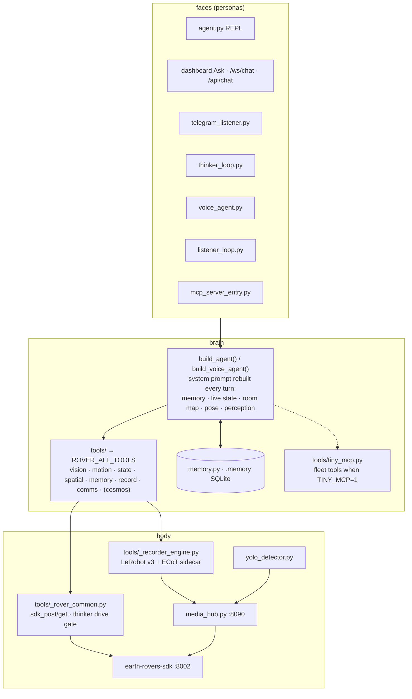

# Architecture

```
┌──────────────┐   HTTP    ┌──────────────────┐  WebRTC/RTM  ┌──────────────┐
│ agent.py     │ ────────► │ earth-rovers-sdk │ ───────────► │  Earth Rover │
│ (Strands)    │  :8002    │ headless Chromium│   Agora      │    Mini+     │
│ voice_agent  │           │ /control /data   │              │   🛞 scout   │
└──────────────┘           │ /v2/front /speak │              └──────────────┘
```

Everything in scout is a *client* of one HTTP surface — the Earth Rovers SDK — and one *brain* — a Strands agent with
`ROVER_ALL_TOOLS`. The rest is plumbing that lets many faces share that brain safely.

## The layers



### Faces
Every entry point builds the **same** agent. `agent.py` owns `build_agent(persona=…, fleet=…)`; `voice_agent.py` owns the bidi
variant; `mcp_server_entry.py` exposes the toolbelt to Claude/Cursor as an MCP server. Personas differ only in *prompt persona*,
*channel* and whether they get [fleet tools](../fleet.md).

### Brain
- **Per-turn state injection** — the system prompt is rebuilt each turn with `recall_block()` (memory), `live_state_block()`
  (battery/GPS/IMU/lamp from `/data`), `spatial_block()` (room map + pose) and `perception_block()` (latest YOLO). No defensive
  "where am I" tool calls.
- **Real vision** — `rover_see` returns Converse-format image blocks; the model *sees* the frame.
- **Memory** — `memory.py` keeps turns, observations and reflections in `.memory/` SQLite, shared by all personas.

### Body
- **Safety in one place** — `rover_move` clamps to `[-1, 1]`, re-streams `/control` (the firmware wants a continuous stream)
  and always auto-stops after `duration`, even on exceptions. `rover_navigate` batches steps; `rover_async` streams from a
  background queue so the agent keeps thinking while it rolls.
- **The thinker drive gate** — `_rover_common.sdk_post` refuses `/control` when `SCOUT_PERSONA=thinker` and the owner's
  `thinker_drive` flag is off (stop frames still pass). The autonomous persona physically cannot drive unless allowed.
- **MediaHub** — one drainer for mic + cameras, fan-out to recorder/YOLO/voice/cockpit ([Perception](../perception.md)).
- **Recorder** — every turn with ≥1 action becomes a LeRobot episode; reasoning traces and detections are aligned sidecars
  ([Datasets](../datasets.md)).

## Deployment shape

Seven containers from one image plus two host processes — see [Docker compose](../start/docker.md) for the table and
[Personas](../personas.md) for why the supervisor lives on the host. The cockpit (:8080) is the only public surface; the SDK
(:8002) and hub (:8090) stay on the LAN.

## Trust boundaries

| boundary | mechanism |
|---|---|
| internet → cockpit | Cloudflare tunnel (real TLS) → self-signed origin → **WebAuthn passkey session** on every `/api/*` and WS |
| cockpit → persona containers | host-side **scout-supervisor** over a unix socket, fixed allow-list, token, audit log — no docker socket in any container |
| autonomous persona → wheels | `thinker_drive` flag checked in `sdk_post` |
| sibling robot → scout | `POST /api/chat` builds the agent with `fleet=True` → no fleet tools → one hop max |
| agent containers → fleet | `.tiny-mcp.env` only mounted into dashboard/telegram/thinker/voice; `sdk`/`media`/`yolo` never see the token |

## Repository map

| path | what |
|---|---|
| `agent.py` `voice_agent.py` `thinker_loop.py` `telegram_listener.py` `listener_loop.py` | the personas |
| `dashboard_server.py` `dashboard_replay.py` `personas.py` `auth.py` `tls.py` `scout_mdns.py` `field_setup.py` | the cockpit and its gate |
| `docs/` | the cockpit's **static frontend** (`index.html`, `replay.html`, `js/`, `css/`) — served by the dashboard, not this site |
| `website/` | this documentation site (`mkdocs.yml`, `website/hooks/gen.py`) |
| `tools/` | `@tool` modules + engines (`_recorder_engine.py`, `_controller_engine.py`, `_rover_common.py`) |
| `media_hub.py` `media_client.py` `yolo_detector.py` `cosmos_buffer.py` | perception |
| `memory.py` `tools/rover_memory.py` `tools/reasoning_log.py` | the shared brain |
| `deploy/` | `scout_supervisor.py` + systemd units |
| `docker/entrypoint.sh` `Dockerfile.scout.slim` `docker-compose.slim*.yml` | the image and the stack |
| `tests/` | pytest — auth tokens, episode index, personas, tiny_mcp, docs drift |
