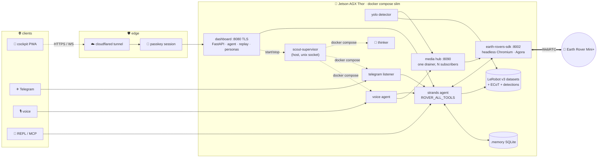

🛞 <b>scout</b> · a small robot with a big curiosity

# sees · thinks · drives · remembers

<strong>scout</strong> is a <a href="https://strandsagents.com">Strands</a> agent living on a Jetson AGX Thor that drives a
<a href="https://www.frodobots.com/">FrodoBots Earth Rover Mini+</a>. It looks through the rover's two cameras, talks through its speaker,
listens on its mic, takes orders from a passkey-gated web cockpit, Telegram or your voice — and <em>records every drive</em>
as a LeRobot dataset with the agent's own reasoning aligned frame-by-frame.

a stylised stand-in, drawn from primitives — the real
Earth Rover Mini+ CAD is linked on the <a href="hardware/">hardware page</a> (not redistributed: no license on the source repo)

[First drive in 60 s](start/first-drive.md){ .md-button .md-button--primary }
[Open the cockpit](dashboard.md){ .md-button }
[Tools reference](reference/tools/index.md){ .md-button }

## What is scout, in five bullets

- **One agent, many faces.** The same Strands agent answers in the REPL, the web cockpit's Ask box, Telegram, a bidirectional
  voice session over the rover's own mic and speaker, and a slow background *thinker* that wakes every minute to do one useful thing.
  → [Personas](personas.md)
- **Real vision, real safety.** Camera tools return actual image blocks the model sees; every motion tool clamps to `[-1, 1]`,
  re-streams `/control` frames (the firmware wants a continuous stream) and **always auto-stops** — even on exceptions.
  → [Tools](reference/tools/index.md)
- **A cockpit you can trust from anywhere.** FastAPI + vanilla JS PWA, sealed behind WebAuthn passkeys and HTTPS, exposed through a
  Cloudflare Tunnel. Joystick, cameras, live agent stream, persona switches, dataset replay. → [Dashboard](dashboard.md)
- **Every drive is data.** A LeRobot v3 recorder captures 10 Hz video + 27-D state + 2-D action, with the agent's reasoning trace
  as an Embodied-Chain-of-Thought sidecar and YOLO detections aligned to the same frames. → [Datasets](datasets.md)
- **Fleet-aware.** With `TINY_MCP=1` the agents mount tiny.technology's MCP tools and can ask sibling robots (Reachy, Fomo, Q…)
  for help — allow-listed, self-invoke refused, one hop deep. → [Fleet](fleet.md)

## How it fits together

Ports and services come straight from `docker-compose.slim.yml` + `docker-compose.slim.override.yml` — see [Architecture](guide/architecture.md).

<b>sdk :8002</b>earth-rovers-sdk — headless Chromium joined to the rover's Agora channel; `/control` `/data` `/v2/front` `/speak`

<b>dashboard :8080</b>FastAPI cockpit (TLS) — agent, cameras, joystick, personas, replay; the only thing the tunnel exposes

<b>media :8090</b>MediaHub — single drainer for mic + cameras, fan-out to recorder / YOLO / voice

<b>yolo</b>Ultralytics on the hub's front stream → `detections/episode_N.jsonl` sidecars

<b>telegram · thinker · voice</b>persona containers (profiles), switched live from the cockpit via the host supervisor

<b>cloudflared</b>public hostname → `https://localhost:8080`, real TLS at the edge

## Where to next

-   :material-rocket-launch:{ .lg .middle } **Start**

    ---

    What you need, installing on the brain, docker compose slim, the `.env` walkthrough, first drive.

    [:octicons-arrow-right-24: Start here](start/hardware.md)

-   :material-monitor-dashboard:{ .lg .middle } **Dashboard**

    ---

    Passkey gate, camera tiles, glass joystick, Ask stream, persona pills, dataset replay.

    [:octicons-arrow-right-24: The cockpit](dashboard.md)

-   :material-eye:{ .lg .middle } **Perception**

    ---

    MediaHub fan-out, YOLO sidecars, the Locate-Anything "who to follow" idea.

    [:octicons-arrow-right-24: Perception](perception.md)

-   :material-database:{ .lg .middle } **Datasets & replay**

    ---

    LeRobot v3, ECoT traces, why episodes are sealed, how to repair an index.

    [:octicons-arrow-right-24: Datasets](datasets.md)

-   :material-tools:{ .lg .middle } **Tools reference**

    ---

    Every `@tool`, generated from the code at build time — signatures and docstrings.

    [:octicons-arrow-right-24: Reference](reference/tools/index.md)

-   :material-wrench:{ .lg .middle } **Operations**

    ---

    Bring-up order, restart recipes, tunnel, watchdogs, what to check before a demo.

    [:octicons-arrow-right-24: Runbook](guide/operations.md)

