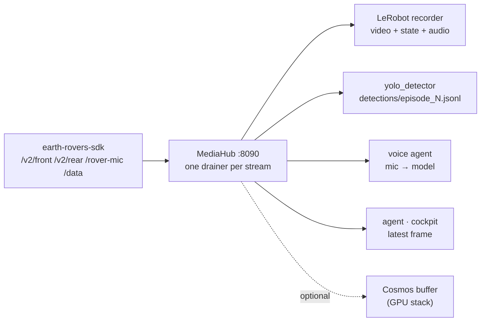

# Perception — one camera, many eyes

The Earth Rover Mini+ exposes **one mic and one camera pair** through the SDK, and half a dozen consumers want them at once:
the agent, the recorder, YOLO, the voice persona, the cockpit. Polling independently duplicates WebRTC round-trips, misaligns
frames and — for the mic — steals audio. So scout has a hub.

## MediaHub — single drainer, N subscribers

`media_hub.py` runs as the `media` service (:8090). One drainer per stream (`front`, `rear`, `mic`, `data`) pulls from the SDK at a
steady cadence (`MEDIA_HUB_VIDEO_INTERVAL`, `MEDIA_HUB_MIC_INTERVAL`, `MEDIA_HUB_DATA_INTERVAL`) and fans every sample out:

| endpoint | who uses it |
|---|---|
| `GET /latest/{stream}` | "what do you see right now" — agent, cockpit |
| `WS /media/{stream}` · `GET /stream/{stream}` | every sample, in order — recorder, YOLO, voice |
| `POST /publish/{stream}` | in-process producers pushing into the hub |
| `GET /status` | drain rates, subscriber counts |

Because every subscriber sees the **same frame at the same timestamp**, sidecars line up with the dataset video by construction.
`media_client.py` is the thin client (`latest_frame_b64`, `latest_data`, `Subscription`) with an in-process fallback when the hub
is not running.



## YOLO — detections as an aligned sidecar

`yolo_detector.py` (the `yolo` service) subscribes to the hub's `front` (and optionally `rear`) stream and runs an Ultralytics model
on every `YOLO_EVERY_N`th frame (`YOLO_MODEL=yolov8n.pt`, `YOLO_CONF=0.35`, `YOLO_IMGSZ`, `YOLO_DEVICE`). While the recorder has an
episode open it writes:

```json
{"frame": 143, "ts": 1758000000.12, "cam": "front",
 "dets": [{"cls": "person", "conf": 0.91, "xyxy": [212, 88, 401, 470]}]}
```

to `<dataset>/detections/episode_000143.jsonl` — keyed by the recorder's frame index, so a detection can be joined to the exact
video frame, state row and reasoning step. The latest detections are also injected into the agent's system prompt
(`perception_block()` in `agent.py`) so the model knows *"person ahead, 0.9"* without a tool call.

`DET_BACKEND=yolo` is the default; `locate` switches to the open-vocabulary backend below.

## Spatial prior — the room map

`tools/room_map.py` parses an **Apple RoomPlan** `.usdz` scan straight from its USDA geometry: the meshes are semantically named
(`sofa_rect0`, `refrigerator0`, `wall_*`, `door_*`, `floor_<Room>_*`), so labels + bounding boxes become a compact spatial prompt
block — no photos, no ML. The repo ships `cagatay_lab.usdz` as the example; point `SCOUT_ROOM_SCAN` at your own.

## Where am I — dead reckoning

GPS is useless indoors. `tools/rover_pose.py` integrates commanded velocities per motion segment with a midpoint heading and an
IMU complementary-filter yaw correction (`SCOUT_IMU_YAW_TRUST`) into `{x, y, yaw}` in the **RoomPlan frame**, so the agent can say
*"I'm near the sofa"*. Drift-aware: after 30 min or 8 m (`SCOUT_POSE_DRIFT_BUDGET_M`) it flags `STALE` and asks to be re-seeded.

## Idea: Locate Anything as the "who" picker

NVIDIA's *Locate Anything* (open-vocabulary grounding) is not a tracker — it is slow and heavy. The plan that fits scout's loop:

1. **YOLO** stays the 10 Hz tracker (cheap, aligned sidecar).
2. **Locate Anything** answers the *who/what* question once per intent — *"follow the person in the blue jacket"* → a box → the
   YOLO track that overlaps it becomes the target.
3. The follow controller drives `rover_async` toward the box centre with a distance setpoint from box height; loses the track →
   stop, ask again.

The dependency-isolated backend already exists (`DET_BACKEND=locate`, its own venv, `LOCATE_MODEL`/`LOCATE_QUERY`/`LOCATE_ATTN`);
the notes are in [Locate Anything](notes/locate-anything.md). The follow controller is not built yet.

## Cosmos (GPU stack only)

With `scout:latest` and `SCOUT_ENABLE_COSMOS=1`, `tools/rover_cosmos.py` adds NVIDIA Cosmos tools — caption/reason over clips
the `cosmos_buffer.py` ring-buffer keeps, and text/image→video generation. Slim pins Cosmos off; the tools are simply absent.
