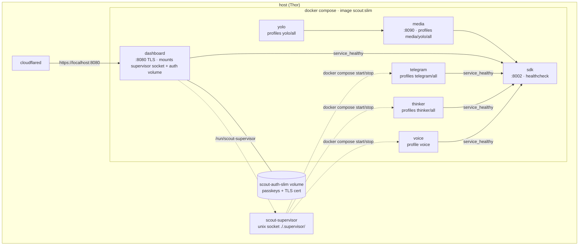

# Docker compose (slim)

Two files, one image. `docker-compose.slim.yml` defines the core; `docker-compose.slim.override.yml` adds the media hub,
YOLO and the supervisor socket mount. Always pass both:

```bash
alias scout-compose='docker compose -f docker-compose.slim.yml -f docker-compose.slim.override.yml'
scout-compose --profile all up -d
scout-compose ps
scout-compose logs -f dashboard
```



## Services

| service | container | command | port | profile | reads `.tiny-mcp.env`? |
|---|---|---|---|---|---|
| `sdk` | `scout-slim-sdk` | `sdk` | **8002** | core | no |
| `dashboard` | `scout-slim-dashboard` | `dashboard` | **8080** (TLS) | core | yes |
| `media` | `scout-slim-media` | `media` | **8090** | `media` `yolo` `all` | no |
| `yolo` | `scout-slim-yolo` | `yolo` | — | `yolo` `all` | no |
| `telegram` | `scout-slim-telegram` | `telegram` | — | `telegram` `all` | yes |
| `thinker` | `scout-slim-thinker` | `thinker` | — | `thinker` `all` | yes |
| `voice` | `scout-slim-voice` | `voice` | — | `voice` only | yes |

Only the four **agent** services get the optional `.tiny-mcp.env` (the tiny.technology fleet token) — `sdk`, `media` and `yolo`
never see it. `SCOUT_ENABLE_COSMOS` is hard-pinned to `0` in slim.

## Shared mounts

Every service mounts the same host directories, so personas and the dashboard see one world:

| host path | in container | what |
|---|---|---|
| `./datasets` | `/app/datasets` | LeRobot datasets, one per day per persona |
| `./.memory` | `/app/.memory` | SQLite brain, `personas.json` flags, reasoning traces |
| `./captures`, `./screenshots` | same | frames and cockpit screenshots the tools save |
| volume `scout-auth-slim` | `/app/.scout_auth_vol` | passkey store `auth.json` + TLS cert — survives rebuilds |
| `./.supervisor` (dashboard only) | `/run/scout-supervisor` | the supervisor's unix socket |

## Environment the compose file sets for you

- `ROVER_SDK_URL=http://sdk:8002` inside the network (your `.env` value is for local runs).
- `DASH_TLS=true`, `DASH_TLS_DIR=/app/.scout_auth_vol/tls`, `SCOUT_AUTH_ENABLED=true`, `SCOUT_AUTH_STORE=/app/.scout_auth_vol/auth.json`.
- `SCOUT_MDNS=true`, `SCOUT_MDNS_NAME=scout` → `scout.local` on the LAN.
- `THINKER_INTERVAL` (default 60), `VOICE_PROVIDER` (default openai), `SCOUT_BRIEFING_MUTE_SOURCES` (default `thinker`).
- `MEDIA_HUB_URL=http://media:8090`, `YOLO_MODEL=yolov8n.pt`, `YOLO_CONF=0.35`, `YOLO_EVERY_N=2`, `DET_BACKEND=yolo`.

Everything else comes from your `.env` → [Configuration](config.md). The full list of variables the code reads is in
[Environment variables](../reference/env.md).

## Lifecycle

```bash
scout-compose --profile all up -d                 # start (idempotent)
scout-compose restart dashboard                   # code change in a bind-mounted asset? see below
scout-compose --profile all build && scout-compose --profile all up -d   # after Dockerfile/requirements changes
scout-compose --profile voice up -d voice         # voice persona (also via the cockpit's 🎙 pill)
scout-compose rm -sf voice                        # stop it and free the rover mic
scout-compose --profile all down                  # stop everything (volumes stay)
```

!!! warning "Stopping the thinker mid-episode"
    A `docker stop`/`rm -sf` while an episode is being written truncates the parquet the recorder is streaming. Since the
    sealing fix every *finished* episode is safe; only the in-flight one is lost. Prefer the cockpit's persona switch, which the
    thinker checks between cycles.

!!! tip "Fast UI iteration"
    The cockpit's static files (`docs/index.html`, `docs/js`, `docs/css`) are inside the image. For quick iteration
    `docker cp docs/. scout-slim-dashboard:/app/docs/` then rebuild once you're happy. Behind Cloudflare, bump the `?v=`
    on asset URLs in `index.html` — the edge caches `/js` and `/css` for hours.

## The GPU stack

`docker-compose.yml` + `Dockerfile.scout` build `scout:latest` on `vllm/vllm-omni:cosmos3` with the Cosmos reasoner as a
service. Same entrypoint, same personas, plus `cosmos3_*` tools. Not needed for anything on this site.
